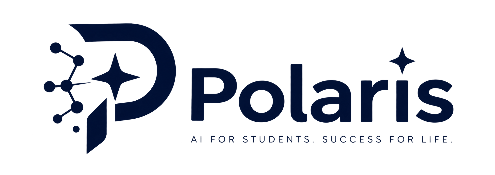

<div align="center">
  
</div>

# Polaris — AI Academic Navigator

> Turn handwritten notes + a syllabus into a coverage map, gap analysis, curated free resources, a revision plan, a knowledge graph, and a career path.

**Status:** MVP. Upload notes → OCR → chunk + embed → ask questions on `/chat` → grounded answers with page-level citations. See [Phase 3 summary](docs/phase-summaries/phase-3.md) for the full story.

---

## Stack

| Layer | Choice |
|---|---|
| Frontend | Next.js 14 (App Router, TS strict) · Tailwind · shadcn/ui |
| Backend | FastAPI (Pydantic v2) · Python 3.11 |
| Runtime | docker-compose (api · qdrant · jaeger · firebase emulators · redis) |
| Auth / DB / Storage | Firebase Auth + Firestore + Firebase Storage (free tier) |
| OCR | PaddleOCR in arq worker |
| Embeddings | sentence-transformers (MiniLM) → NV-Embed via NVIDIA NIM (Phase 9) |
| Vector DB | Qdrant Cloud (free tier) |
| LLM | Groq (Llama 3.1 70B) |
| Agents | LangGraph + Firestore checkpointing |
| Observability | OpenTelemetry → Jaeger · LangSmith for LLM traces |
| Deploy | Vercel (frontend) · Render (backend) |

Full rationale: see [ADR index](docs/adr/).

---

## Quickstart

Prerequisites: Docker Desktop (WSL2), Node 20+, Python 3.11, `just` (`winget install Casey.Just`).

```bash
# 1. Clone
git clone https://github.com/SazWhatician/Polaris.git
cd Polaris

# 2. Configure (copy and fill in values)
cp backend/.env.example backend/.env
cp frontend/.env.local.example frontend/.env.local

# 3. Bring up the stack
just up

# 4. Frontend dev server (separate terminal)
cd frontend && npm install && npm run dev
```

Backend: http://localhost:8000/docs · Frontend: http://localhost:3000 · Jaeger: http://localhost:16686

---

## Build Plan

11-phase plan in `docs/build-plan.md` (mirrored from `~/.claude/plans/`).

| Phase | Outcome | Status |
|---|---|---|
| 0 | Foundation + engineering spine | ✅ |
| 1 | Auth + document management | ✅ |
| 2 | OCR pipeline | ✅ |
| 3 | RAG chat + eval harness (**MVP**) | ✅ |
| 4 | Syllabus intelligence | ✅ |
| 5 | Learning gap agent | ✅ |
| 6 | Resource discovery agent | ✅ |
| 7 | Revision planner agent | ✅ |
| 8 | Knowledge graph engine | ✅ |
| 9 | Multi-LLM failover router | ✅ |
| 10 | Academic digital twin + Pathfinder career agent + deploy | ✅ |
| 11 | Ambient study layer (PolarAssist integration) | ✅ |

Phase summaries live in `docs/phase-summaries/`.

---

## Docs

- [Architecture](docs/architecture.md) — system + sequence diagrams
- [ADR index](docs/adr/) — every non-obvious decision, defended
- [Phase summaries](docs/phase-summaries/) — what shipped per phase + concepts learned
- [Runbook](docs/runbook.md) — operational gotchas

## License

MIT — see [LICENSE](LICENSE).
