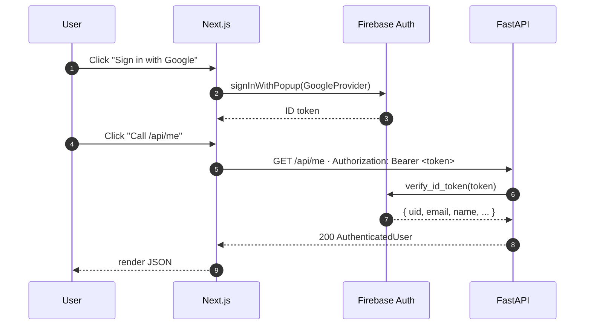

# Architecture

> Living document. Updated at the end of every phase. As of Phase 0: only the auth + observability spine exists.

## System (current — Phase 3 MVP)


## System (target — by Phase 10)


## Auth round-trip (Phase 0)



## Layer boundaries (enforced by code review)

```
api/        -- HTTP concerns only: parse, validate, call service, format response
services/   -- business logic: orchestrates repositories + external clients
repositories/  -- single source of truth for Firestore / Qdrant access
agents/     -- LangGraph state machines (Phase 5+)
prompts/    -- versioned .md prompts; loaded by name+version (Phase 3+)
workers/    -- arq task definitions (Phase 2+)
models/     -- Pydantic schemas: domain + request/response
core/       -- cross-cutting: config, logging, otel, firebase init, deps
```

Rule of thumb: **business logic never lives in `api/`**, **data access never lives in `services/`**. Reviewers should reject PRs that violate these.

## Observability

- **Structured JSON logs** via structlog. Every log line carries `request_id` (from `X-Request-Id` header or minted UUID).
- **Distributed traces** via OpenTelemetry → Jaeger. FastAPI and httpx are auto-instrumented. Manual spans wrap business operations (`with tracer.start_as_current_span("ocr.process_page")`).
- **LangSmith** (Phase 3+) captures full LLM traces — every retrieval, prompt assembly, and Groq call is replayable.
- **Sentry** (Phase 10) for production errors.

## Multi-tenant isolation

Every Firestore document is keyed under `users/{uid}/...`. Every Qdrant query passes a `payload filter: user_id == uid`. Security rules enforce this at the DB layer; backend code is the second wall.

---

## 11-Phase Build Plan

Below is the complete, detailed implementation roadmap for the project (mirrored from the development plans).

### Context
Polaris is an AI Academic Navigator designed to turn student notes + a syllabus into a coverage map, learning-gap report, recommended resources, revision plan, knowledge graph, and career-path recommender. The roadmap is structured to ensure that the project is not just a demo, but a tested, traced, evaluated, and production-ready portfolio piece.

### What "impresses interviewers" (The Non-Negotiables)
1. **Clear architectural boundaries:** Routes → services → repositories → models. No business logic in route handlers. No Firestore calls outside repository classes.
2. **Type safety end-to-end:** Pydantic models drive the OpenAPI schema; the frontend consumes types generated from that schema (`openapi-typescript`).
3. **Async correctness:** No sync I/O inside `async def` handlers. Heavy blocking tasks (PaddleOCR, embedding models) run in background workers.
4. **Tests at three levels:** Unit, integration (using Firestore + Qdrant emulators), and one happy-path Playwright end-to-end test.
5. **Observability from day 1:** Structured JSON logs, OpenTelemetry traces via Jaeger, and LangSmith trace capture.
6. **Evals for LLM-driven features:** Retrieval metrics (precision@k, MRR) and LLM-as-judge scoring.
7. **CI/CD from commit #1:** GitHub Actions for linting, type-checking, testing, and Docker builds.
8. **Prompt versioning:** Prompts stored as `.md` files in `backend/app/prompts/` and loaded by version.
9. **Secrets discipline:** Strict use of environment variables and `.gitignore` to avoid leaking credentials.
10. **Architecture Decision Records (ADRs):** Documenting non-obvious engineering decisions.
11. **Comprehensive README:** Informative docs, architecture diagrams, and quickstarts.

### Architectural Decisions Summary

| Layer | Choice | Rationale |
|---|---|---|
| Frontend | Next.js 14 App Router, TS strict, Tailwind, shadcn/ui | RSCs, streaming, code-owned components |
| Backend | FastAPI, Python 3.11, Pydantic v2 | Auto OpenAPI, async-native, type-driven contracts |
| Runtime | `docker-compose` (backend, Qdrant, Jaeger, Firebase emulator) | Repr. env, parity with prod |
| Auth | Firebase Auth (server-side ID token verification) | Free, secure, ready-to-use |
| DB | Firestore + security rules | Fast, easy scaling, emulator support |
| Storage | Firebase Storage (with signed upload URLs) | Direct-to-storage browser uploads, light backend |
| OCR | PaddleOCR (run in `arq` worker) | Isolates CPU-heavy work from API threads |
| Embeddings | `sentence-transformers/all-MiniLM-L6-v2` locally | Swift starting point; evaluated against NV-Embed in Phase 9 |
| Vector DB | Qdrant Cloud free tier | Payload filtering for clean multi-tenant isolation |
| LLM | Groq (`llama-3.1-70b-versatile` / free models) | Extremely fast inference, OpenAI-compatible client |
| Agent FW | LangGraph | State graph is traceable, testable, and robust |
| Tracing | OpenTelemetry → Jaeger + LangSmith | Complete execution visibility |
| Task queue | `arq` (Redis-backed async queue) | Pure async, lightweight |

### Cross-cutting Tracks

| Track | Enters at | Grows by |
|---|---|---|
| **CI** | Phase 0 | Lint/type → +unit tests (P1) → +integration (P2) → +evals on PR (P3) → +build/deploy (P10) |
| **Testing** | Phase 0 | Healthcheck test → +service unit tests → +repository integration tests → +Playwright e2e |
| **Observability** | Phase 0 | Request IDs + JSON logs → OTel traces (P2) → LangSmith (P3) → token/cost dashboards (P5) |
| **Evals** | Phase 3 | Golden set + retrieval metrics → LLM-as-judge → regression gate in CI |
| **ADRs** | Phase 0 | One per non-obvious choice (aiming for ~12-15 total by Phase 10) |

### Per-Phase Deliverable Contract
Every phase must produce:
1. A **PR-style summary** (`docs/phase-summaries/phase-N.md`).
2. **At least one ADR** detailing architectural choices.
3. **Automated tests** validating the additions.
4. **CI/CD configuration updates** as needed.
5. **Updated README** and/or demo assets.

---

### Detailed Phase Breakdown

#### Phase 0 — Foundation + Engineering Spine
* **Goal:** FastAPI + Qdrant + Jaeger + Firebase emulators up in `docker-compose`. Next.js communicates with API. Authentication and OTel tracing propagation are functional.
* **Deliverables:** Docker configuration, Pydantic settings, structlog setup, OTel trace middleware, Firebase verified token auth, basic UI spine.
* **ADRs:** ADR 0001 (Firebase/Qdrant over Supabase/pgvector), ADR 0002 (arq over Celery).

#### Phase 1 — Auth & Document Management
* **Goal:** Signed URL uploads for PDFs/images directly to storage. Metadata indexing in Firestore with strict security rules.
* **Deliverables:** API routes, document services, GCS signed URLs, security rules test suite, frontend `/dashboard`.
* **ADRs:** ADR 0003 (Signed URLs vs proxy uploads).

#### Phase 2 — OCR Pipeline
* **Goal:** Asynchronous file processing pipeline. `arq` worker handles OCR using PaddleOCR, saving pages back to Firestore.
* **Deliverables:** Redis/arq integration, image preprocessing, multi-stage Docker build caching OCR models, idempotency checks.
* **ADRs:** ADR 0004 (arq vs other task runners).

#### Phase 3 — Vector Search + RAG Chat + Eval Harness (MVP)
* **Goal:** Streamed RAG completions with page-level citations. Offline/CI eval harness evaluating retrieval precision and answer quality.
* **Deliverables:** Text chunking, local embeddings, payload-filtered vector queries, SSE streaming backend endpoint, frontend `/chat` interface, LLM-as-judge evaluation script.
* **ADRs:** ADR 0005 (Eval methodology), ADR 0006 (Chunking strategy).

#### Phase 4 — Syllabus Intelligence
* **Goal:** Extract syllabus topics hierarchically using JSON-mode LLM. Map coverage score based on retrieved note context.
* **Deliverables:** `syllabus_service` parser, coverage computation logic, recursive tree UI with coverage progress indicators.
* **ADRs:** ADR 0007 (Structured output handling).

#### Phase 5 — Learning Gap Agent
* **Goal:** Multi-node LangGraph classifying topic status (Known, Weak, Missing) and sorting them topologically based on prerequisites.
* **Deliverables:** LangGraph node logic, Firestore checkpoint persistence, status/reordering UI.
* **ADRs:** ADR 0008 (State persistence + resumability).

#### Phase 6 — Resource Discovery Agent
* **Goal:** Automatically fetch and cache relevant study assets (YouTube videos, articles) for weak or missing topics.
* **Deliverables:** YouTube API integration, resource ranking agent, slowapi rate-limiting.
* **ADRs:** ADR 0009 (Rate-limiting + caching).

#### Phase 7 — Revision Planner Agent
* **Goal:** Day-by-day scheduler balancing exam dates, study hours, and weak areas. Support revision plan diffing.
* **Deliverables:** Planner agent, plan-diffing backend logic, `/plan` calendar interface.
* **ADRs:** ADR 0010 (Plan representation + diffing).

#### Phase 8 — Knowledge Graph Engine
* **Goal:** Concept and relationship extraction from study materials, visualized as an interactive node graph.
* **Deliverables:** NER pipeline, NetworkX server caching, Cytoscape interactive graph UI.
* **ADRs:** ADR 0011 (Graph storage: denormalized Firestore vs Neo4j).

#### Phase 9 — Academic Digital Twin
* **Goal:** Maintain persistent user knowledge profile updating in real-time. Benchmark embedding upgrade (MiniLM vs NV-Embed).
* **Deliverables:** Incremental twin model, readiness query handler, embedding performance evaluation report.
* **ADRs:** ADR 0012 (Embedding upgrade evaluation), ADR 0013 (Twin update model).

#### Phase 10 — Pathfinder Career Agent + Production Deploy
* **Goal:** Cross-agent composition mapping career paths to skills and material. Live production deployments with Sentry observability.
* **Deliverables:** Pathfinder composition agent, Vercel/Render production deploys, final README update.
* **ADRs:** ADR 0014 (Deployment topology & cold-start tradeoffs).

---

### Verification & Operations
* **Verification:** Run `just test` and `just eval` to guarantee no regressions. Verify health checks inside Docker. Check Jaeger/LangSmith for trace validation.
* **Open Loops:** Keep track of emulator limits on Windows, LangSmith trace quota management, Groq free-tier rate limits, Qdrant memory constraints under high-dimensional embedding models, and PaddleOCR image layer footprints.

