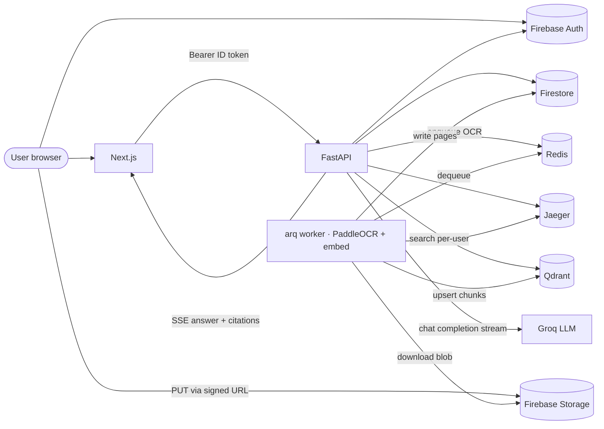
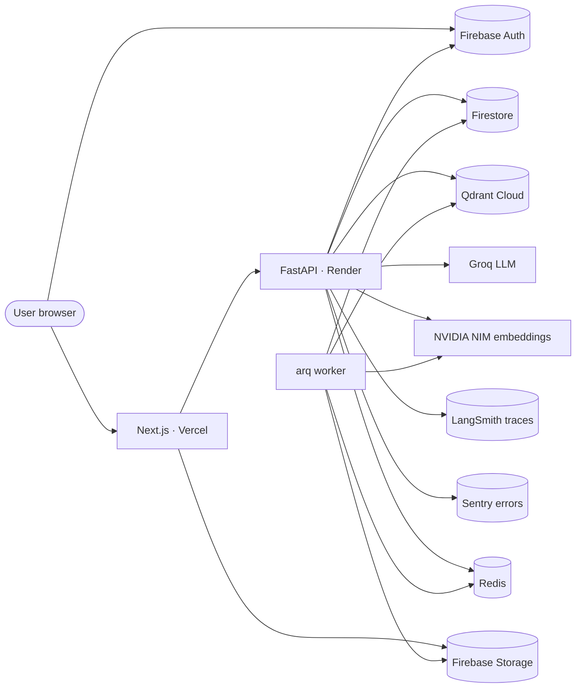
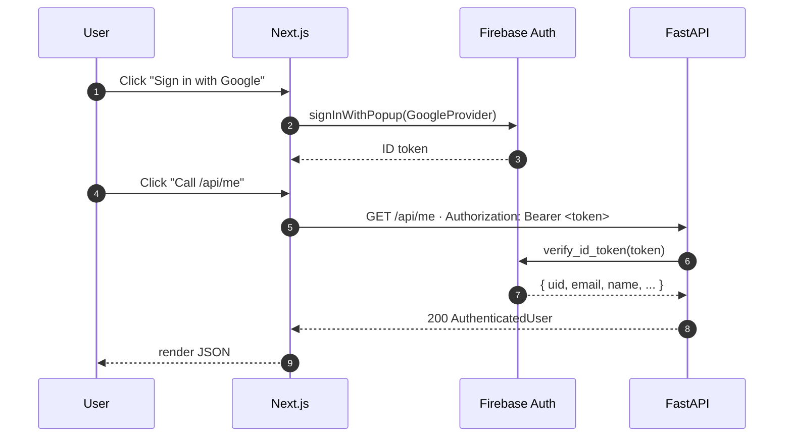

# Architecture

> Living document. Updated at the end of every phase. As of Phase 0: only the auth + observability spine exists.

## System (current — Phase 3 MVP)



## System (target — by Phase 10)



## Auth round-trip (Phase 0)



## Layer boundaries (enforced by code review)

```
api/        -- HTTP concerns only: parse, validate, call service, format response
services/   -- business logic: orchestrates repositories + external clients
repositories/  -- single source of truth for Firestore / Qdrant access
agents/     -- LangGraph state machines (Phase 5+)
prompts/    -- versioned .md prompts; loaded by name+version (Phase 3+)
workers/    -- arq task definitions (Phase 2+)
models/     -- Pydantic schemas: domain + request/response
core/       -- cross-cutting: config, logging, otel, firebase init, deps
```

Rule of thumb: **business logic never lives in `api/`**, **data access never lives in `services/`**. Reviewers should reject PRs that violate these.

## Observability

- **Structured JSON logs** via structlog. Every log line carries `request_id` (from `X-Request-Id` header or minted UUID).
- **Distributed traces** via OpenTelemetry → Jaeger. FastAPI and httpx are auto-instrumented. Manual spans wrap business operations (`with tracer.start_as_current_span("ocr.process_page")`).
- **LangSmith** (Phase 3+) captures full LLM traces — every retrieval, prompt assembly, and Groq call is replayable.
- **Sentry** (Phase 10) for production errors.

## Multi-tenant isolation

Every Firestore document is keyed under `users/{uid}/...`. Every Qdrant query passes a `payload filter: user_id == uid`. Security rules enforce this at the DB layer; backend code is the second wall.
