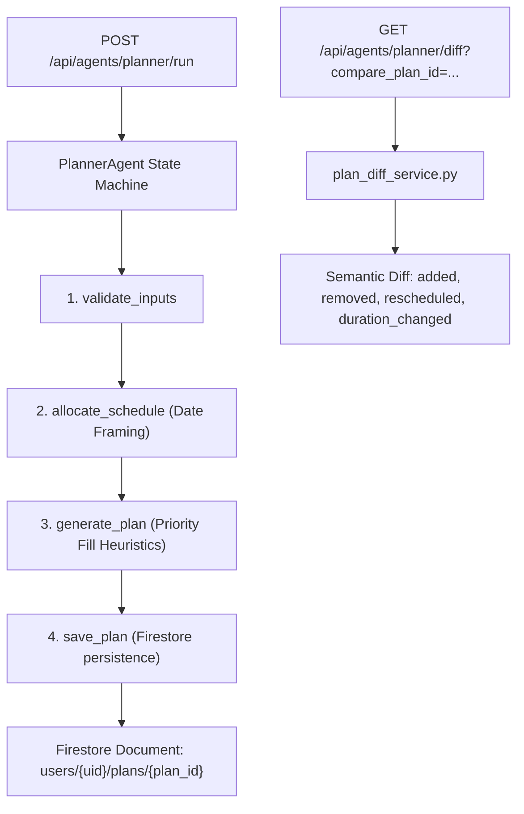

# Phase 7 — Revision Planner Agent (LangGraph + Plan Diffing Engine + Firestore)

- **Status:** Complete
- **Date:** 2026-07-30
- **Primary Deliverables:** `planner_agent.py`, `plan_diff_service.py`, `plan_repo.py`, `/api/agents/planner/*` routes, ADR 0013.

## Overview
Phase 7 adds the **Revision Planner Agent**, an automated study schedule engine that converts target exam dates, user daily available study hours, and topic gaps into day-by-day revision plans. It also features a deterministic semantic plan diff engine to track schedule shifts across re-planning runs.

## Architecture & Data Flow

## Key Deliverables

| File | Purpose |
|---|---|
| [`app/models/planner.py`](file:///c:/Users/saswa/Desktop/Polaris/backend/app/models/planner.py) | Pydantic models for `StudyBlock`, `DaySchedule`, `RevisionPlan`, `PlanDiffItem`. |
| [`app/services/plan_diff_service.py`](file:///c:/Users/saswa/Desktop/Polaris/backend/app/services/plan_diff_service.py) | Pure Python deterministic semantic diffing utility comparing plan revisions. |
| [`app/repositories/plan_repo.py`](file:///c:/Users/saswa/Desktop/Polaris/backend/app/repositories/plan_repo.py) | Firestore persistence repository for storing and querying user plans. |
| [`app/agents/planner_agent.py`](file:///c:/Users/saswa/Desktop/Polaris/backend/app/agents/planner_agent.py) | 4-node LangGraph state machine with checkpointing support. |
| [`app/api/planner_agent.py`](file:///c:/Users/saswa/Desktop/Polaris/backend/app/api/planner_agent.py) | FastAPI endpoints (`POST /run`, `GET /runs/{thread_id}`, `GET /latest`, `GET /diff`). |
| [`docs/adr/0013-revision-plan-representation-and-diffing.md`](file:///c:/Users/saswa/Desktop/Polaris/docs/adr/0013-revision-plan-representation-and-diffing.md) | ADR recording decision for deterministic date bounds and semantic diffing. |

## Verification & Testing
- **Unit Tests:** `backend/tests/unit/test_plan_diff_service.py` and `backend/tests/unit/test_planner_agent.py`.
- Evaluates input validation, constraint enforcement, plan generation, and diffing accuracy.
