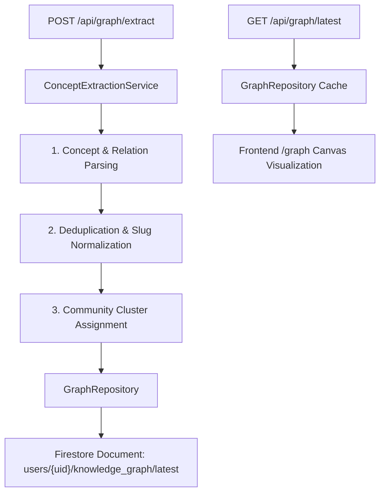

# Phase 8 — Knowledge Graph Engine

- **Status:** Complete
- **Date:** 2026-08-02
- **Primary Deliverables:** `concept_extraction_service.py`, `graph_repo.py`, `models/graph.py`, `/api/graph/*` routes, `KnowledgeGraphViewer`, `/graph` frontend page, ADR 0015.

## Overview

Phase 8 implements the **Knowledge Graph Engine**, enabling Polaris to extract key concepts, prerequisite dependencies, and community clusters from student notes and syllabi. Concepts are stored in Firestore with in-memory graph caching, and rendered in an interactive force-directed skeuomorphic visualization canvas (`/graph`).

## Architecture & Data Flow

## Key Deliverables

| File | Purpose |
|---|---|
| [`backend/app/models/graph.py`](file:///c:/Users/saswa/Desktop/Polaris/backend/app/models/graph.py) | Pydantic models for `ConceptNode`, `ConceptRelationship`, `ConceptCluster`, `KnowledgeGraph`. |
| [`backend/app/services/concept_extraction_service.py`](file:///c:/Users/saswa/Desktop/Polaris/backend/app/services/concept_extraction_service.py) | Concept extraction, deduplication, and community cluster calculation. |
| [`backend/app/repositories/graph_repo.py`](file:///c:/Users/saswa/Desktop/Polaris/backend/app/repositories/graph_repo.py) | Firestore persistence + in-memory graph cache. |
| [`backend/app/api/graph.py`](file:///c:/Users/saswa/Desktop/Polaris/backend/app/api/graph.py) | FastAPI endpoints (`POST /extract`, `GET /latest`, `GET /nodes/{node_id}`). |
| [`frontend/components/knowledge-graph-viewer.tsx`](file:///c:/Users/saswa/Desktop/Polaris/frontend/components/knowledge-graph-viewer.tsx) | Interactive HTML5 canvas force-directed graph viewer with zoom/pan, cluster coloring, and node inspector. |
| [`frontend/app/graph/page.tsx`](file:///c:/Users/saswa/Desktop/Polaris/frontend/app/graph/page.tsx) | Knowledge Graph page layout with step-by-step workflow navigation and telemetry cards. |
| [`docs/adr/0015-knowledge-graph-representation-and-networkx-cache.md`](file:///c:/Users/saswa/Desktop/Polaris/docs/adr/0015-knowledge-graph-representation-and-networkx-cache.md) | ADR recording decision for Firestore persistence and cached graph traversal strategy. |

## Verification & Testing
- **Unit Tests:** `backend/tests/unit/test_graph.py` (3/3 passed).
- **Frontend Build:** `npm run build` (10/10 static pages compiled cleanly).
