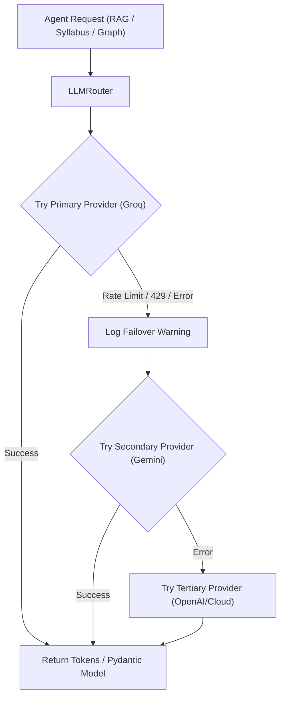

# Phase 9 — Multi-LLM Provider Failover Engine & Unified Model Router

- **Status:** Complete
- **Date:** 2026-08-02
- **Primary Deliverables:** `BaseLLMProvider`, `GroqProvider`, `GeminiProvider`, `LLMRouter`, `test_multi_llm_router.py`, ADR 0016.

## Overview

Phase 9 introduces the **Multi-LLM Provider Failover Engine**, insulating Polaris against rate limits (429), API key exhaustion, or vendor outages. The engine normalizes completions, SSE token streams, and Pydantic structured output parsing across multiple LLM providers under a resilient fallback router (`LLMRouter`).

## Architecture & Data Flow

## Key Deliverables

| File | Purpose |
|---|---|
| [`backend/app/services/llm/base.py`](file:///c:/Users/saswa/Desktop/Polaris/backend/app/services/llm/base.py) | Abstract base interface for normalized LLM providers. |
| [`backend/app/services/llm/groq_provider.py`](file:///c:/Users/saswa/Desktop/Polaris/backend/app/services/llm/groq_provider.py) | Groq sub-second low-latency Llama-3 provider wrapper. |
| [`backend/app/services/llm/gemini_provider.py`](file:///c:/Users/saswa/Desktop/Polaris/backend/app/services/llm/gemini_provider.py) | Google Gemini Flash/Pro provider wrapper. |
| [`backend/app/services/llm/router.py`](file:///c:/Users/saswa/Desktop/Polaris/backend/app/services/llm/router.py) | Resilient multi-provider fallback failover router. |
| [`backend/tests/unit/test_multi_llm_router.py`](file:///c:/Users/saswa/Desktop/Polaris/backend/tests/unit/test_multi_llm_router.py) | Unit tests verifying rate-limit failover and streaming fallback. |
| [`docs/adr/0016-multi-llm-provider-failover-router.md`](file:///c:/Users/saswa/Desktop/Polaris/docs/adr/0016-multi-llm-provider-failover-router.md) | Architecture Decision Record for Multi-LLM provider failover router. |

## Verification & Testing
- **Unit Tests:** `backend/tests/unit/test_multi_llm_router.py` (3/3 passed).
