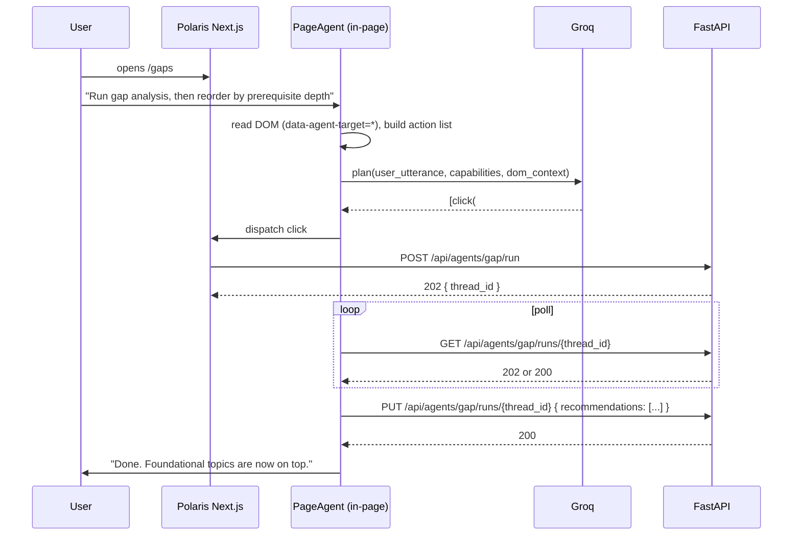
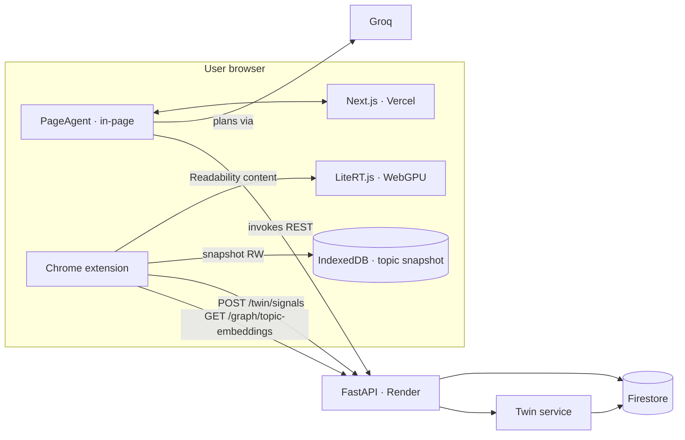

# Proposal — Phase 11: Ambient Study Layer (PageAgent + LiteRT.js)

> **Status:** Proposed (not yet started)
> **Depends on:** Phase 8 (knowledge graph, provides topic embeddings), Phase 9 (digital twin, consumes signals), Phase 10 (public deploy)
> **Estimated effort:** 6–8 days

---

## 1. Motivation

Polaris 0–10 knows everything the student does **inside the app**: which notes they uploaded, which chats they ran, which topics the gap agent flagged, which recommendations they marked done. The system is blind the moment the student closes the Polaris tab.

Every competing "AI study" product has the same blind spot. It is the single largest gap between what a digital-twin model *claims* to know about a learner and what is actually happening.

Phase 11 fills that gap using two 2026-era libraries:

- **[alibaba/page-agent](https://github.com/alibaba/page-agent)** — a JavaScript in-page GUI agent that manipulates the DOM via LLM-selected actions, plus an optional Chrome extension for cross-tab workflows.
- **[LiteRT.js](https://developers.googleblog.com/litertjs-googles-high-performance-web-ai-inference/)** — Google's WebAssembly + WebGPU runtime for `.tflite` models, released July 2026. Runs on-device with no server call.

Together they turn the browser itself into a **sensor + actuator** for Polaris. The digital twin from Phase 9 gets its blind spot removed; the copilot experience inside Polaris gets a natural-language shell over every agent the system exposes.

## 2. Non-goals

- **No** running an LLM on-device. `LiteRT-LM.js` exists but its bundle + first-load cost is a portfolio-liability; Groq stays authoritative for generative calls.
- **No** replacing any existing agent. LangGraph agents remain the source of truth for state changes. PageAgent invokes them via the same REST endpoints the frontend already uses.
- **No** cross-user data sharing. Everything the extension observes is either (a) discarded after on-device embedding + threshold check, or (b) posted to the current user's own Firestore under the same rules as the web app.

## 3. Two independent workstreams

The phase has two logically separable pieces; either can ship without the other.

### 3.1 In-page copilot (PageAgent inside Polaris itself)

An always-available floating action button on every Polaris page. Click → opens a natural-language input. PageAgent reads the current page's DOM to understand context ("user is on `/gaps` viewing the Algorithms syllabus"), then plans and executes actions against the app's own routes.

Example utterances (all deliverable Day 1):

| Utterance | What PageAgent does |
|---|---|
| *"Run gap analysis on the Algorithms syllabus, then open the top three weak topics"* | Clicks `Run Agent` → polls until 200 → clicks the three highest-influence topic cards |
| *"Reorder my study plan so I hit foundational topics first"* | Calls `PUT /api/agents/gap/runs/{thread_id}` with reordered recommendations (uses the Phase 5 endpoint that already exists) |
| *"Show me the pages of my notes where I mention backprop"* | Navigates to `/chat`, submits a scoped query, opens the citations panel |
| *"What am I most ready to learn next?"* | Calls the Phase 9 twin readiness endpoint, renders the result as a modal |

Implementation requirements:
- `data-agent-target="..."` attributes on interactive components (already a good idea for e2e tests; PageAgent piggybacks on them).
- A small `frontend/lib/page-agent/config.ts` that lists the app's high-level "capabilities" so PageAgent's planner has a fixed action vocabulary rather than being asked to invent one from raw DOM.
- Groq wired as the LLM adapter, reusing the Phase 3 key already in `NEXT_PUBLIC_*` env (or proxied through `/api/agent-llm` if we don't want the key on the client; **see ADR 0015**).

### 3.2 Cross-tab sensor (Chrome extension using PageAgent's extension mode + LiteRT.js)

A separately-installable Chrome extension. On every page the user visits (opt-in, per-domain allowlist by default: youtube.com, arxiv.org, wikipedia.org, github.com, developer.mozilla.org, docs.python.org, plus a user-editable list) the extension:

1. Waits for `document.readyState === 'complete'` + a 2s idle debounce.
2. Extracts the "primary content" via a Readability-style extractor (Mozilla's `@mozilla/readability` — already MIT).
3. Runs LiteRT.js on-device to embed the extracted text (chunked at 512 tokens) with a quantized `all-MiniLM-L6-v2.tflite`.
4. Loads the user's topic-embedding snapshot from `chrome.storage.local` (refreshed daily from `GET /api/graph/topic-embeddings`) and computes max cosine similarity between the page and each topic.
5. If `max_sim > 0.72` and the matched topic is in `{weak, missing}` for the user, surface:
   - A subtle badge on the extension icon (`"1"`).
   - Optional side-panel showing "This looks like it covers **Transformer Attention** — one of your weak topics."
6. If the user then engages meaningfully with the page (definition of "engagement" varies by site: watched >60 % of a YouTube video via `chrome.tabs` timer; scrolled >70 % of an article; spent >2 min on a docs page), the extension batches a **passive study signal** and posts it to Polaris.

```json
POST /api/twin/signals
{
  "source": "extension",
  "url_hash": "sha256(url)",
  "domain": "youtube.com",
  "matched_topic_id": "algorithms/graph-theory/dijkstra",
  "similarity": 0.81,
  "engagement": { "kind": "video_watched", "fraction": 0.87, "duration_s": 723 },
  "occurred_at": "2026-08-14T13:22:41Z"
}
```

The backend endpoint (new, thin) writes to a new `TwinSignal` sub-collection, and the Phase 9 twin update service processes the signal on its next tick (event-driven update if we chose that in ADR 0013; scheduled if we chose scheduled).

## 4. Architecture

### 4.1 Data flow — in-page copilot



### 4.2 Data flow — extension sensor

```mermaid
sequenceDiagram
    participant Ext as Chrome extension
    participant LRT as LiteRT.js (WebGPU)
    participant IDB as IndexedDB
    participant API as Polaris FastAPI
    participant Twin as Phase 9 twin service

    Note over Ext: Every allow-listed page load
    Ext->>Ext: extract primary content (Readability)
    Ext->>LRT: embed(chunks) [on-device, WebGPU]
    LRT-->>Ext: [384-dim vectors]
    Ext->>IDB: read topic-embedding snapshot
    Ext->>Ext: max cosine sim, compare to threshold
    alt match found and topic status ∈ {weak, missing}
        Ext->>Ext: show badge / side panel
        Note over Ext: Wait for engagement heuristic
        Ext->>API: POST /api/twin/signals
        API->>Twin: enqueue signal
        Twin->>Twin: update knownConcepts / velocity
    end

    Note over Ext,API: Daily refresh
    Ext->>API: GET /api/graph/topic-embeddings
    API-->>Ext: snapshot { topic_id: [f32; 384], status }
    Ext->>IDB: replace snapshot
```

### 4.3 System diagram (delta vs. Phase 10)



## 5. New APIs

| Method | Path | Purpose | Auth |
|---|---|---|---|
| GET | `/api/graph/topic-embeddings` | Returns the user's topic → embedding snapshot for extension caching. Small (~50 KB gzipped for a typical 200-topic syllabus). | Bearer |
| POST | `/api/twin/signals` | Ingest a passive study signal from the extension. Rate-limited to 100/hour/user via slowapi. | Bearer |
| GET | `/api/agent-llm/plan` *(optional, iff we hide the Groq key from the client)* | Server-side proxy for PageAgent's planning call. Returns the same JSON the Groq client would. | Bearer |

## 6. Concrete deliverables

### Backend
- `app/api/twin_signals.py` — new router: `POST /signals`, list-for-debug, delete-mine.
- `app/api/graph_embeddings.py` — `GET /topic-embeddings` returning a Cache-Control'd snapshot.
- `app/services/twin_signal_service.py` — validation, dedup by `(user, url_hash, occurred_at_bucket)`, enqueue for the twin worker.
- `app/services/topic_embedding_snapshot.py` — reads Phase 8's stored embeddings, gzips, sets `ETag` for cheap conditional GETs from the extension.
- `app/models/twin_signal.py` — Pydantic schemas.
- *(optional)* `app/api/agent_llm.py` — proxy endpoint, guarded by rate limit and prompt-length caps.
- Tests: unit for signal validation + dedup; integration for endpoint auth + rate-limit; contract test that the emitted snapshot decodes correctly against the fixture the extension uses in its unit tests.

### Frontend (Polaris app)
- `frontend/lib/page-agent/` — thin wrapper around `@alibaba/page-agent`: registers capabilities, mounts floating trigger, wires LLM adapter to Groq (or `/api/agent-llm/plan`).
- Systematic `data-agent-target` attributes added to interactive elements on `/dashboard`, `/gaps`, `/plan`, `/chat`, `/twin`, `/pathfinder`.
- `frontend/components/agent-copilot.tsx` — the floating button + input + result modal.
- Playwright test: "user asks copilot to run gap analysis → gap agent finishes → recommendations render."

### Chrome extension (new sibling app)
- `extension/` — Manifest V3, TypeScript, `pnpm` workspace root added to repo.
- `extension/background/` — service worker: install, alarm-based daily snapshot refresh, message router.
- `extension/content-script/` — Readability extraction, engagement heuristics, badge display.
- `extension/lib/embed.ts` — LiteRT.js session bootstrap + `embed(chunks: string[])` wrapper.
- `extension/lib/model/all-MiniLM-L6-v2.int8.tflite` — checked-in quantized model (~25 MB). Verified against a fixture set for the same top-k results as the server-side MiniLM within a 5 % cosine tolerance (**ADR 0016**).
- `extension/lib/similarity.ts` — cosine + threshold logic.
- `extension/popup/` — small React UI for status, allowed-domains list, "sync now" button.
- Unit tests (vitest): Readability extractor, engagement heuristics, similarity math. E2E test loads the extension in Playwright and asserts a signal is posted when a fixture page is visited.

### Docs
- `docs/adr/0015-in-page-agent-llm-key-boundary.md` — decision: proxy Groq call through backend vs. ship key with limited scope to client (**recommendation: proxy, +50 ms latency, but keeps rate-limit + abuse control server-side**).
- `docs/adr/0016-on-device-embedding-parity.md` — decision: on-device quantized MiniLM must stay within an eval-measured parity envelope of the server-side model, or the extension falls back to a `POST /api/embed` roundtrip for classification (with a user notification about privacy).
- `docs/adr/0017-passive-signal-schema-and-privacy.md` — decision: what the extension may send off-device, dedup key, retention window, user delete rights.
- `docs/phase-summaries/phase-11.md` — written at phase close, following the standard summary format.

## 7. Evals

Two eval dimensions are new. Both go into the existing `evals/` harness.

1. **Extension classification quality.** A hand-labeled fixture of ~150 URLs, each tagged with the "true" topic-id it covers (or `null` for irrelevant). Metric: precision@1 of matched-topic vs. label. Target: **≥ 0.75 precision @ recall 0.60**, degrading gracefully below threshold rather than misclassifying.
2. **On-device / server-side embedding parity.** Same 150 fixture chunks embedded by both the on-device quantized model and the server MiniLM. Metric: rank-correlation of the top-10 nearest topics between the two. Target: **Spearman ρ ≥ 0.90**. If parity slips below this, the extension emits a "consult server" signal instead of classifying locally (see ADR 0016).

CI gates the phase-11 test suite behind both metrics.

## 8. Observability

- Extension events go to a lightweight `/api/telemetry/extension` endpoint (opt-in) so we can see aggregate throughput, per-domain match rates, and false-positive rates.
- Every `POST /twin/signals` is wrapped in an OTel span (`twin.signal.ingest`) with `source=extension`, `domain`, `matched_topic_id` on the span. LangSmith is unchanged (no LLM calls added on the ingest path).
- Extension errors surface via `chrome.runtime.lastError` → structured console → optional Sentry (browser SDK) once we have a project set up.

## 9. Risks / open questions

| Risk | Mitigation |
|---|---|
| **LiteRT.js browser matrix.** WebGPU is Chrome + Safari 18+; older browsers fall back to WASM CPU which is 5–10× slower. | Feature-detect, fall back to server embedding via `POST /api/embed` with a small UI banner. |
| **Model asset weight** (~25 MB `.tflite`). | Host on Firebase Storage with `Cache-Control: immutable`, fetched once per install; version-pinned via URL. |
| **PageAgent DOM brittleness** when Polaris UI evolves. | Enforce `data-agent-target` in code review; add a Playwright test that fails if a documented capability's target attribute goes missing. |
| **Groq key exposure.** | Default to server-side proxy (ADR 0015). |
| **False positives on the extension.** | Threshold + engagement heuristics + easy per-domain disable in the popup. Log false-positive corrections when the user clicks "not this topic" — becomes eval signal. |
| **Privacy optics.** A browser extension that reads pages is a big commitment. | Full opt-in; per-domain allowlist; nothing sent server-side unless a topic matches AND engagement threshold hits; user can wipe all signals from settings. All of this is stated in the extension's install screen. |

## 10. Alternatives considered

- **Skip PageAgent and roll our own in-page assistant** with a plain input box + a hand-written intent parser. Rejected: PageAgent's DOM planner already handles the hardest part (mapping utterance → DOM action sequence with error recovery). Not worth reimplementing.
- **Skip LiteRT.js and do all embedding server-side.** Rejected: defeats the entire privacy story of the extension and adds one server round-trip per page-view — free tier can't wear that.
- **Use `Transformers.js` (ONNX Runtime Web) instead of LiteRT.js.** Legitimate alternative. LiteRT.js chosen for (a) newer, faster WebGPU backend, (b) smaller runtime bundle (~1.5 MB vs ~4 MB), (c) LiteRT-LM.js as a future upgrade path if we ever want on-device LLM. ADR 0016 records the comparison.
- **Ship PageAgent's Chrome extension unmodified** rather than writing our own. Rejected: their extension is a general-purpose agent, we want a *sensor* first and an actuator second. We use `page-agent` as a library inside our extension.

## 11. Learning beats

- **In-page GUI agents vs. server-side agents** — where each is authoritative, how they compose without one owning state the other mutates.
- **On-device inference tradeoffs** — WebGPU vs. WASM backends, quantization impact on retrieval quality, bundle-cost accounting.
- **Cross-tab data collection with real privacy discipline** — opt-in patterns, on-device filtering as a privacy primitive, retention + delete rights.
- **Closing agent loops** — a system that only *recommends* is weaker than one that recommends *and observes consumption*. This is the mechanical realization of the "closed loop learning system" you already reference in the Phase 9 pitch.

## 12. Definition of done

- Extension installs from a `chrome://extensions` unpacked build; passes the Manifest V3 review-lint against Chrome Web Store rules (even if we don't publish).
- Both new evals green in CI at their stated thresholds.
- End-to-end Playwright demo: user opens a fixture "YouTube-like" page → extension shows badge → user simulates engagement → Polaris `/twin` shows the new signal within one twin-update tick.
- `docs/phase-summaries/phase-11.md` written; ADRs 0015–0017 merged; architecture diagram updated.
- README v3 gains a 30-second GIF of the extension in action and a paragraph on the privacy model.
