# Polaris — Generative & Agentic AI Study Plan

> **Learning Goal:** Master production-grade Generative AI, RAG architecture, LangGraph stateful agents, LLMOps evals, and multi-agent orchestration by building **Polaris** (An AI Academic Navigator).

---

## 🎯 Learning Objectives

By working through this study plan, you will move from basic LLM API scripting to engineering **resumable, stateful, evaluated, and production-hardened AI agent systems**.

```mermaid
flowchart LR
    P0["P0: Foundational Spine"] --> P1["P1: Storage & Auth"]
    P1 --> P2["P2: Async OCR Worker"]
    P2 --> P3["P3: RAG + Eval Harness"]
    P3 --> P4["P4: Structured Syllabus Intelligence"]
    P4 --> P5["P5: LangGraph Gap Agent"]
    P5 --> P6["P6: Resource Discovery Agent"]
    P6 --> P7["P7: Revision Planner Agent"]
    P7 --> P8["P8: Knowledge Graph Engine"]
    P8 --> P9["P9: Academic Digital Twin"]
    P9 --> P10["P10: Pathfinder Career Agent & Deploy"]
    P10 --> P11["P11: Ambient On-Device Layer"]
```

---

## 🧠 Core GenAI & Agentic AI Curriculum

### 1. Advanced RAG & Vector Search
- **Document Ingestion & Splitting:** Content-aware text chunking (`RecursiveCharacterTextSplitter`), page-level metadata tracking, and deduplication hashing.
- **Multi-Tenant Vector Isolation:** Payload-filtered vector queries in **Qdrant** (`user_id == uid`) preventing cross-tenant data leaks.
- **Embedding Dynamics & Tradeoffs:** Cosine similarity search, local models (`sentence-transformers/all-MiniLM-L6-v2`) vs. cloud high-dimensional embeddings (`NV-Embed`).

### 2. Prompt Engineering & System Dynamics
- **Prompt Versioning & File Management:** Storing prompts as versioned markdown assets in `backend/app/prompts/` rather than hardcoded strings.
- **Token Streaming & Cancellation:** Server-Sent Events (SSE) streaming for low latency with active request cancellation handling (closing downstream LLM connections on disconnect).
- **Structured LLM Output & Schema Reliability:** JSON-mode calling, Pydantic v2 validation, and corrective retry loops for invalid JSON responses.

### 3. Stateful Agents & LangGraph
- **LangGraph State Machines:** Node-based workflow graphs (`load -> assess -> rank -> recommend`), conditional edges, and fallback branches.
- **State Persistence & Resumability:** Saving agent state checkpoints to Firestore so interrupted runs can resume from exact execution steps.
- **Multi-Agent Orchestration:** Composing specialized sub-agents into high-level supervisor agents (e.g., *Pathfinder* orchestrating *Gap*, *Resource*, and *Digital Twin* agents).

### 4. LLMOps, Evals & Benchmarking
- **Retrieval Metrics:** Measuring Precision@K, Recall@K, and Mean Reciprocal Rank (MRR) against a golden dataset.
- **LLM-as-a-Judge:** Evaluating generated responses using stronger judge models against rubrics for grounding, correctness, and completeness.
- **CI/CD Quality Gates:** Automated regression testing blocking PR merges if retrieval or answer quality drops by >5%.
- **Distributed Observability:** Full-stack distributed tracing via OpenTelemetry → Jaeger and LLM run-tracing via LangSmith.

### 5. Knowledge Graphs (Graph-RAG) & Digital Twins
- **Entity & Relation Extraction (NER):** Extracting `(concept_a, relation, concept_b)` triples with spaCy + LLMs and deduplicating via embedding similarity.
- **Graph Algorithms:** Utilizing NetworkX for community detection (Louvain algorithm) and centrality scoring, rendered via Cytoscape.
- **Stateful User Modeling:** Maintaining an incremental digital twin updating user knowledge state dynamically.

---

## 📅 Phase-by-Phase Study & Implementation Plan

### Phase 0 — Foundation + Engineering Spine
* **Focus:** Setup docker-compose, FastAPI, Firebase emulators, Qdrant, Jaeger tracing, and Next.js spine.
* **GenAI / Engineering Concepts:** OpenTelemetry trace propagation across services, multi-stage Docker builds, server-side auth token verification.
* **Deliverables:** `docker-compose.yml`, OTel middleware, structlog setup, protected `/api/me` endpoint.
* **ADRs:** ADR 0001 (Firebase + Qdrant choice), ADR 0002 (arq over Celery).

### Phase 1 — Document Management & Storage
* **Focus:** Authenticated direct-to-storage PDF uploads using signed URLs and metadata indexing.
* **GenAI / Engineering Concepts:** Direct storage upload vs. proxying, OpenAPI-driven TypeScript client generation (`openapi-typescript`), Firestore security rules.
* **Deliverables:** Backend v4 signed URL generator, Firestore rules test suite, frontend `/dashboard`.
* **ADRs:** ADR 0003 (Signed URLs vs Proxy Uploads).

### Phase 2 — Async OCR Pipeline
* **Focus:** Background document OCR processing using Redis and `arq`.
* **GenAI / Engineering Concepts:** Offloading heavy CPU workloads (PaddleOCR) from request threads, idempotent processing via content hashing (`sha256`), async worker task retries.
* **Deliverables:** `arq` worker container, PaddleOCR page processing pipeline, document status transitions.
* **ADRs:** ADR 0004 (arq vs Celery/RQ).

### Phase 3 — Two-Stage RAG Chat Engine + FlashRank Reranking + Eval Harness (MVP)
* **Focus:** Streamed grounded RAG chat with two-stage retrieval (Dense Qdrant Search + Ultra-fast FlashRank Cross-Encoder reranking) and continuous evaluation suite.
* **GenAI / Engineering Concepts:** Bi-Encoder vs. Cross-Encoder tradeoffs, multi-tenant vector retrieval, ONNX CPU cross-encoder execution (<15ms), SSE token streaming, prompt versioning, offline evaluation harness (Precision@K, MRR, LLM-as-Judge), CI eval regression gating.
* **Deliverables:** `services/rag_service.py`, `services/rerank_service.py`, `evals/` dataset & runners, `/chat` interface with citation chips, LangSmith trace integration.
* **ADRs:** ADR 0005 (Eval Methodology), ADR 0006 (Chunking Strategy), ADR 0015 (Two-Stage Reranking via FlashRank).

### Phase 4 — Syllabus Intelligence
* **Focus:** Extracting topic trees from syllabi and mapping coverage scores against user notes.
* **GenAI / Engineering Concepts:** JSON-mode structured outputs, schema validation retries, heuristic + LLM hybrid scoring metrics.
* **Deliverables:** `syllabus_service.py`, topic tree parser, recursive syllabus UI with progress indicators.
* **ADRs:** ADR 0007 (Structured Output Handling Strategy).

### Phase 5 — Learning Gap Agent (LangGraph)
* **Focus:** Autonomous agent classifying knowledge status (Known/Weak/Missing) and topological topic sorting.
* **GenAI / Engineering Concepts:** LangGraph graph design, state checkpointing in Firestore for resumable agent runs, conditional retry edges, LangSmith node tracing.
* **Deliverables:** `agents/gap_agent.py`, Firestore checkpointer, `/gaps` interactive priority board.
* **ADRs:** ADR 0008 (State Persistence & Resumability).

### Phase 6 — Resource Discovery Agent
* **Focus:** Curating and ranking study resources (YouTube, web articles) for weak topics under quota constraints.
* **GenAI / Engineering Concepts:** Multi-source data aggregation, LLM-as-Ranker rubrics, third-party API rate-limiting (`slowapi`) and caching layer.
* **Deliverables:** `youtube_service.py`, `resource_agent.py`, `/resources` recommendation UI.
* **ADRs:** ADR 0009 (Rate Limiting & Caching Strategy).

### Phase 7 — Revision Planner Agent
* **Focus:** Generating personalized, constraint-aware study schedules with plan diffing.
* **GenAI / Engineering Concepts:** Constraint satisfaction in prompts, semantic diffing of LLM outputs, date-aware schedule validation.
* **Deliverables:** `planner_agent.py`, schedule diff algorithm, `/plan` calendar view.
* **ADRs:** ADR 0010 (Plan Representation & Diffing).

### Phase 8 — Knowledge Graph Engine & Force-Directed Physics Topology
* **Focus:** Concept extraction and interactive 2D/3D physics-driven force-directed graph with prerequisite flow particles.
* **GenAI / Engineering Concepts:** SpaCy NER + LLM triple extraction `(entity, relation, entity)`, NetworkX community detection, `react-force-graph` d3-force physics simulation, glowing importance halos, directional particle flows for prerequisite mastery.
* **Deliverables:** `concept_extraction.py`, `graph_repo.py`, `knowledge-graph-viewer.tsx`, `/graph` interactive physics visualization UI.
* **ADRs:** ADR 0011 (Graph Storage: Firestore + NetworkX vs. Graph DB).

### Phase 9 — Academic Digital Twin
* **Focus:** Maintaining a dynamic user knowledge model and performing embedding upgrades based on evals.
* **GenAI / Engineering Concepts:** Stateful user modeling, event-driven profile updates, empirical model comparison (MiniLM vs. NV-Embed).
* **Deliverables:** `twin_service.py`, `twin_agent.py`, embedding benchmark evaluation report.
* **ADRs:** ADR 0012 (Embedding Upgrade Evaluation), ADR 0013 (Twin Update Model).

### Phase 10 — Pathfinder Career Agent & Production Deploy
* **Focus:** Multi-agent composition for career roadmaps and production deployment.
* **GenAI / Engineering Concepts:** Hierarchical multi-agent orchestration, production hardening, CORS/CSP policies, observability wiring (Sentry).
* **Deliverables:** `pathfinder_agent.py`, production deploys on Vercel + Render + Qdrant Cloud, production-ready portfolio README.
* **ADRs:** ADR 0014 (Deployment Topology & Cold-Start Tradeoffs).

### Phase 11 — Ambient On-Device Study Layer
* **Focus:** Privacy-preserving on-device browser agent observing study habits locally.
* **GenAI / Engineering Concepts:** On-device WebAssembly LLMs (LiteRT.js / Gemma 2B), DOM extraction, zero-server-cost ambient agents.
* **Deliverables:** `PageAgent` DOM extractor, Chrome Extension / web worker runner, local sync service.

### Phase 12 — UI/UX Luxury Overhaul & WebGL2 Shaders
* **Focus:** Haute Intelligence design system, raw WebGL2 additive aurora shader, stenciled Navier-Stokes fluid logo, and 3D reactor footer.
* **GenAI / Engineering Concepts:** WebGL2 custom fragment shaders, pointer smoothing dynamics, multi-theme colorway matrices.
* **Deliverables:** `polaris-aurora.tsx`, `polaris-liquid-p.tsx`, `reactor-footer.tsx`, `crystal-glow.tsx`.

### Phase 13 — High-Precision Retrieval & Spatial Concept Navigation
* **Focus:** Two-stage RAG precision with FlashRank cross-encoder reranking and interactive physics-directed graph exploration with `react-force-graph-2d`.
* **GenAI / Engineering Concepts:** Bi-encoder vs. Cross-encoder latency/precision Pareto frontier, zero-GPU ONNX execution, d3-force cluster gravity, directional prerequisite particle animation, deep concept inspection linked to RAG chat.
* **Deliverables:** `backend/app/services/rerank_service.py`, `backend/tests/unit/test_rerank_service.py`, `frontend/components/knowledge-graph-viewer.tsx`.

---

## 🛠️ What You Will Be Able to Build On Your Own

After completing this curriculum, you can independently engineer:

1. **Production-Grade RAG Systems**: High-accuracy, multi-tenant Q&A platforms with streaming responses, page-level citations, custom chunking, and isolated vector spaces.
2. **Resumable Autonomous Agents**: Multi-step workflows using LangGraph with state persistence, error handling, rate limiting, and tool use.
3. **Graph-RAG Architectures**: Automated entity/relationship extractors paired with graph visualization engines.
4. **Automated AI Testing Suites (LLMOps)**: Evaluation pipelines in CI/CD that protect against prompt regressions and hallucinations.
5. **Multi-Agent Orchestrators**: Complex agent systems where higher-level agents delegate tasks to specialized sub-agents.

---

## 📄 Reference Documents
* [architecture.md](file:///c:/Users/saswa/Desktop/Polaris/docs/architecture.md) — System architecture, sequence diagrams, and technology choices.
* [build-plan.md](file:///c:/Users/saswa/Desktop/Polaris/docs/build-plan.md) — Step-by-step engineering roadmap and per-phase deliverables contract.
